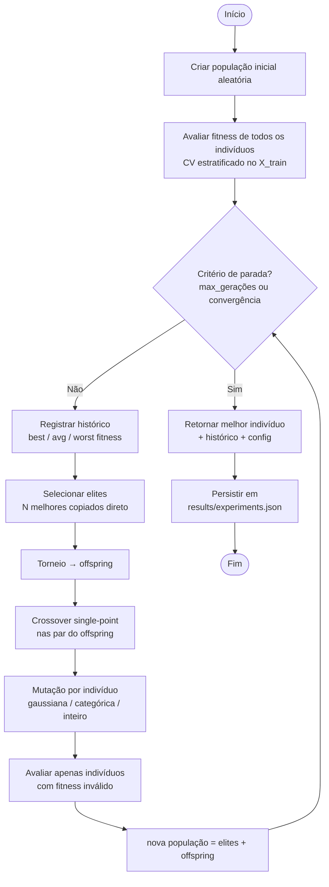
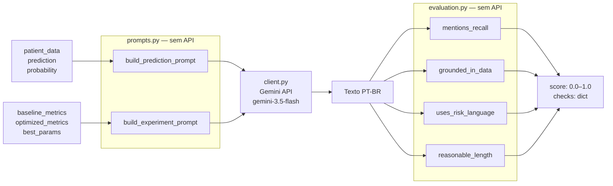
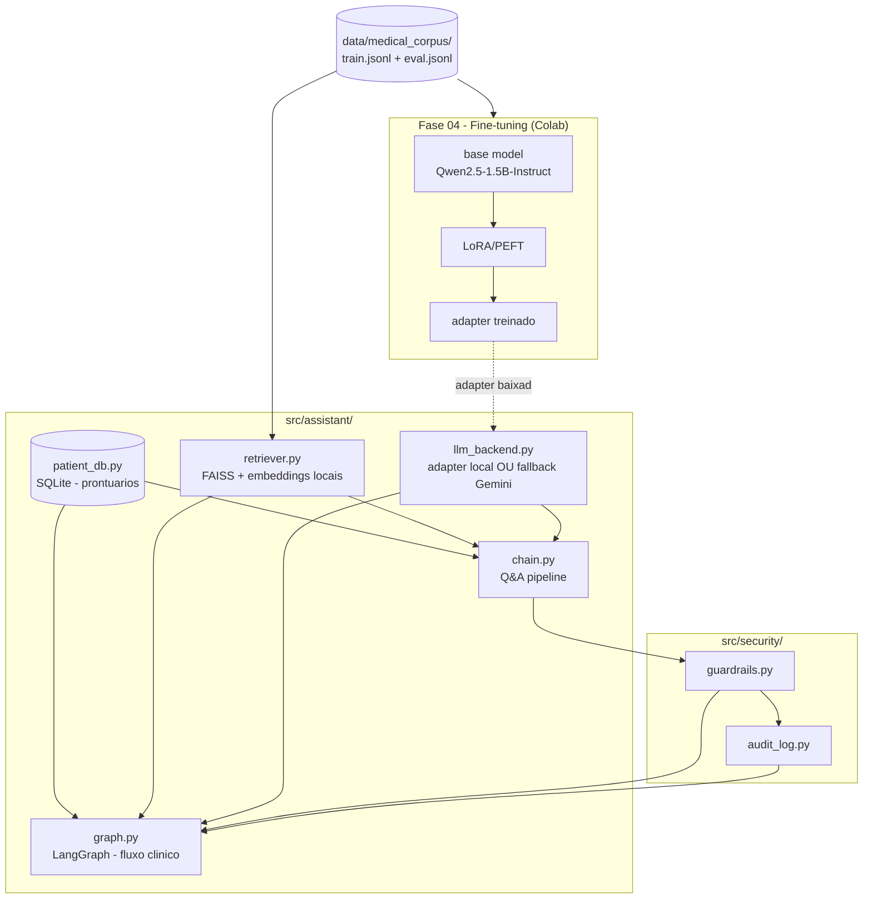
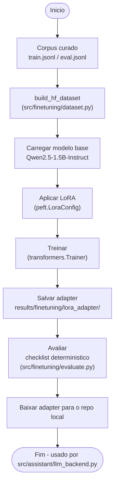
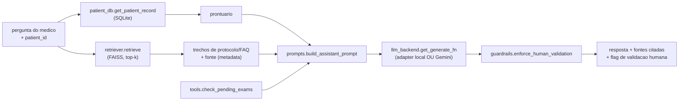
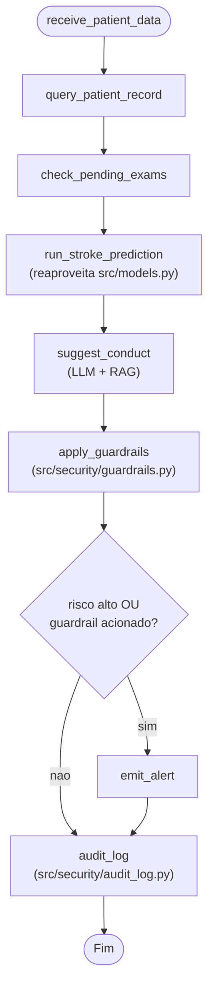

# Arquitetura do Sistema — Stroke Prediction

**FIAP Pós-Tech IA para Devs — Tech Challenge**

Diagramas e decisões técnicas do projeto, organizados por fase. Cada bloco cobre
os módulos introduzidos naquela fase; a Fase 3 reaproveita e estende o que foi
construído na Fase 2.

| Fase | Conteúdo | Seção |
|------|----------|-------|
| 2 | Algoritmo Genético + interpretação via LLM | [Arquitetura Fase 2](#arquitetura-fase-2--algoritmo-genético--interpretação-llm) |
| 3 | Fine-tuning, assistente LangChain, fluxo LangGraph, segurança | [Arquitetura Fase 3](#arquitetura-fase-3--assistente-medico-fine-tuning--langchain--langgraph) |

> A estrutura de diretórios completa e atualizada (com os módulos da Fase 3) está
> no [README](../README.md#estrutura-do-repositório). O relatório técnico da
> Fase 3 está em [`relatorio_tecnico_fase3.md`](relatorio_tecnico_fase3.md).

---

# Arquitetura Fase 2 — Algoritmo Genético + Interpretação LLM

**Tech Challenge Fase 2**

---

## Visão Geral

O sistema combina três camadas:

1. **Pipeline de ML** — pré-processamento e modelos baseline (herdado da Fase 1)
2. **Motor de Otimização Genética** — ajuste automático de hiperparâmetros via DEAP
3. **Camada de Interpretação LLM** — geração de explicações em linguagem natural via Google Gemini

```mermaid
flowchart TD
    DS[(Dataset\nKaggle CSV)]

    subgraph PRE["src/preprocessing.py"]
        P1[load_data]
        P2[clean_data]
        P3[encode_features]
        P4["split_and_balance\n(SMOTE)"]
        P1 --> P2 --> P3 --> P4
    end

    subgraph GA["src/genetic_algorithm/"]
        C[chromosome.py\ndefine espaço de busca]
        F[fitness.py\nCV estratificado no treino]
        O[operators.py\nseleção / crossover / mutação]
        G[ga_optimizer.py\nrun_ga → best_params]
        C --> F --> O --> G
    end

    subgraph MOD["src/models.py"]
        TR["train_lr / train_rf\n(com best_params)"]
        EV[evaluate_model]
        TR --> EV
    end

    subgraph LLM["src/llm/"]
        PR["prompts.py\n(sem API)"]
        CL["client.py\nGemini SDK"]
        IN["interpreter.py\nexplain_prediction\nsummarize_experiment"]
        EX["evaluation.py\nchecklist determinístico"]
        PR --> IN --> CL
        IN --> EX
    end

    DS --> PRE
    PRE -->|X_train, y_train| GA
    PRE -->|X_test, y_test| MOD
    GA -->|best_params| MOD
    EV -->|métricas| RES[(results/\nga_summary.json)]
    RES --> LLM
    LLM --> TXT["Texto em linguagem\nnatural PT-BR\n+ score de qualidade"]
```



---

## Fluxo do Algoritmo Genético



---

## Fluxo da Integração LLM



---

## Estrutura de Diretorios (escopo da Fase 2)

> Recorte dos modulos existentes ao final da Fase 2. Os diretorios adicionados
> na Fase 3 (`src/assistant/`, `src/security/`, `src/finetuning/`,
> `data/medical_corpus/`) estao na secao da Fase 3 e no
> [README](../README.md#estrutura-do-repositório).

```
stroke-prediction/
├── data/
│   └── download_data.py          # Download do dataset via kagglehub
├── src/
│   ├── preprocessing.py          # Pipeline completo de pre-processamento
│   ├── models.py                 # Treino, avaliacao, save/load, predict
│   ├── genetic_algorithm/
│   │   ├── chromosome.py         # Codificacao dos genes e decodificacao
│   │   ├── fitness.py            # Funcao fitness com CV estratificado
│   │   ├── operators.py          # Selecao, crossover, mutacao
│   │   └── ga_optimizer.py       # Loop principal do AG com elitismo
│   └── llm/
│       ├── client.py             # Wrapper do Gemini SDK
│       ├── prompts.py            # Montagem dos prompts (sem chamada de API)
│       ├── interpreter.py        # Orquestra prompts + cliente
│       └── evaluation.py         # Checklist deterministico de qualidade
├── notebooks/
│   ├── 01_baseline.ipynb         # Reproducao da Fase 1 (linha de base)
│   ├── 02_genetic_algorithm.ipynb # Experimentos AG + comparativo
│   └── 03_llm_integration.ipynb  # Demonstracao LLM com avaliacao
├── tests/                        # 54 testes unitarios na Fase 2 (111 na Fase 3)
├── results/
│   ├── experiments.json          # Historico de fitness por geracao
│   └── ga_summary.json           # Metricas baseline vs. otimizado
├── .env.example                  # Template para GOOGLE_API_KEY
└── requirements.txt
```

---

## Modulo 1 — Preprocessamento (`src/preprocessing.py`)

| Funcao | Responsabilidade |
|--------|-----------------|
| `load_data()` | Carrega o CSV; falha com mensagem clara se ausente |
| `clean_data()` | Remove coluna `id`, filtra genero `Other` (3 registros) |
| `encode_features()` | One-Hot Encoding com `drop_first=True` |
| `split_and_balance()` | Split estratificado 80/20 + SMOTE apenas no treino |
| `prepare_pipeline()` | Composicao das quatro funcoes acima |

**Decisao:** o `bmi` nulo e preenchido com a media do conjunto de treino *antes* do SMOTE, evitando vazamento de dados para o teste.

---

## Modulo 2 — Algoritmo Genetico (`src/genetic_algorithm/`)

### Representacao dos Cromossomos (`chromosome.py`)

**Logistic Regression — 4 genes:**

| Gene | Tipo | Espaco de busca |
|------|------|-----------------|
| `C` | float | [0.001, 100.0] |
| `solver_idx` | int | 0–3 → {lbfgs, liblinear, saga, newton-cg} |
| `max_iter` | int | [100, 1000] |
| `cw_idx` | int | 0–1 → {None, "balanced"} |

**Random Forest — 5 genes:**

| Gene | Tipo | Espaco de busca |
|------|------|-----------------|
| `n_estimators` | int | [50, 500] |
| `max_depth_idx` | int | 0 → None; 1–28 → profundidade 3–30 |
| `min_samples_split` | int | [2, 20] |
| `min_samples_leaf` | int | [1, 10] |
| `cw_idx` | int | 0–1 → {None, "balanced"} |

**Decisao:** genes em espaco natural (nao normalizado) para facilitar debug e leitura dos resultados.

### Funcao Fitness (`fitness.py`)

```
fitness = 0.6 * recall_cv + 0.4 * f1_cv
         - 0.15  (penalidade se recall_cv < 0.30)
```

- Avaliada com CV estratificado de 2–5 folds *somente sobre X_train*
- Retorna tupla `(float,)` compativel com DEAP `FitnessMax`

**Decisao:** peso maior para recall por ser metrica clinica principal (minimizar falsos negativos de AVC).

### Operadores (`operators.py`)

| Operador | Implementacao |
|----------|--------------|
| Selecao | Torneio (`tournsize=3`) via `deap.tools.selTournament` |
| Crossover | Single-point (`deap.tools.cxOnePoint`), taxa padrao 0.80 |
| Mutacao float | Gaussiana com sigma proporcional ao intervalo do gene, clamp nos limites |
| Mutacao int categorico | Troca aleatoria entre categorias validas |
| Mutacao int numerico | Passo gaussiano arredondado, clamp nos limites |

---

## Modulo 3 — Integracao LLM (`src/llm/`)

### Estrategia de Prompt Engineering

Dois templates em `prompts.py`:

1. **`build_prediction_prompt`** — diagnostico individual
   - Injeta todos os features do paciente como lista de bullets
   - Instrui o modelo a usar apenas dados fornecidos (sem inventar exames)
   - Pede linguagem de risco, nao diagnostico categorico
   - Exige resposta em PT-BR, objetiva, sem jargao tecnico

2. **`build_experiment_prompt`** — resumo do experimento AG
   - Injeta metricas baseline e otimizado, hiperparametros e deltas calculados
   - Contextualiza o recall como metrica principal (falsos negativos)
   - Pede resumo executivo para gestores de saude

### Checklist de Qualidade (`evaluation.py`)

| Regra | Verificacao |
|-------|-------------|
| `mentions_recall` | Se `source_data` tem chave `recall`, o texto deve mencionar "recall" |
| `grounded_in_data` | Texto cita ao menos um valor numerico presente nos dados de entrada |
| `uses_risk_language` | Texto usa palavras de probabilidade/risco (nao afirmacao categorica) |
| `reasonable_length` | 40 ≤ len(texto) ≤ 4000 |

**Score final:** media aritmetica das 4 regras → float em [0, 1].

**Decisao:** checklist deterministico (nao LLM-as-judge) para ser 100% reprodutivel e executavel em CI sem custo de API.

---

## Decisoes Tecnicas (Fase 2)

| Decisao | Alternativa considerada | Justificativa |
|---------|------------------------|---------------|
| DEAP como framework GA | Implementacao manual | DEAP tem tipos `Individual`/`Fitness` nativos, operadores prontos e e amplamente usado em pesquisa |
| Gemini 3.5 Flash | GPT-3.5, Llama local | Gratuito para o volume do projeto, SDK oficial Python, sem necessidade de infra local |
| CV de 2 folds na fitness | CV de 5 folds | Velocidade de execucao; 5 folds aumenta o tempo ~2.5x sem ganho expressivo dado o SMOTE |
| Checklist deterministico | LLM-as-judge | Sem custo de API, 100% reprodutivel, roda em CI; limitacao: nao captura qualidade semantica fina |
| Fitness = 0.6*recall + 0.4*f1 | Apenas recall | Recall puro incentiva trivialmente prever todos como positivo; o peso de F1 penaliza isso |
| Genes em espaco natural | Genes normalizados [0,1] | Mais legivel nos resultados, mais facil de debugar |
| Elitismo com N fixo | Sem elitismo | Garante monotonia do melhor fitness entre geracoes |

---

## Limitacoes Conhecidas (Fase 2)

- **CV rapido vs. estabilidade:** com `cv=2` e `patience` baixo, os experimentos convergem rapido mas podem ser sensiveis ao `random_state`. Para publicacao, recomenda-se `cv=5` e `patience>=8`.
- **Populacoes pequenas:** populacoes de 20–50 individuos sao adequadas para o espaco de busca (4–5 genes), mas podem perder diversidade em modelos com mais hiperparametros.
- **Qualidade do LLM:** o checklist nao garante que o texto seja clinicamente correto — serve como filtro de sanidade automatico. Revisao humana e necessaria antes de uso clinico real.
- **Dependencia de API externa:** o modulo LLM requer conexao com a API do Google. Sem `GOOGLE_API_KEY` valida, apenas os testes com mock funcionam.
- **Dataset desbalanceado:** mesmo com SMOTE, o desbalanceamento original (4.9% positivos) afeta o threshold de decisao. A funcao fitness com penalizacao de recall < 0.30 mitiga isso, mas nao elimina.

---

# Arquitetura Fase 3 — Assistente Medico (Fine-tuning + LangChain + LangGraph)

**FIAP Pos-Tech IA para Devs — Tech Challenge Fase 3**

Sobre a base da Fase 2, a Fase 3 adiciona tres camadas novas: um pipeline de
fine-tuning (LoRA/PEFT) com dados medicos internos, um assistente LangChain
com RAG sobre esses dados + consulta a um "prontuario" estruturado, e um
fluxo de decisao automatizado em LangGraph com guardrails de seguranca e
logging de auditoria. Dominio: AVC/stroke, para manter coerencia com o
dataset e os modelos ja usados nas Fases 1-2.

## Visao Geral (Fase 3)



## Fluxo de Fine-tuning (`notebooks/04_finetuning.ipynb`, Colab)



**Decisao:** modelo base pequeno e nao-gated (`Qwen2.5-1.5B-Instruct`) em vez
dos pesos oficiais do Llama, evitando a burocracia de acesso gated — ainda
atende ao requisito do desafio ("LLaMA, Falcon **ou outro**"). LoRA em vez de
fine-tuning completo: muito mais rapido/leve (GPU gratuita do Colab e
suficiente) e o adapter resultante e pequeno o bastante para versionar no
repo.

## Fluxo do Assistente LangChain (`src/assistant/chain.py`)



**Decisao:** pipeline deterministico (chamadas diretas em ordem fixa) em vez
de um agente LLM que escolhe quais tools chamar. Mais confiavel e testavel —
elimina o risco do modelo decidir nao consultar o prontuario ou o RAG, ou
chamar uma tool com argumentos invalidos.

## Fluxo de Decisao Automatizado (`src/assistant/graph.py`, LangGraph)



**Decisao:** aresta condicional real (LangGraph `add_conditional_edges`) em
vez de sempre visitar `emit_alert` — demonstra o roteamento condicional do
LangGraph e evita computar/logar um alerta quando nao ha nada a alertar.
`audit_log` roda sempre, nos dois ramos, para garantir rastreabilidade
completa (auditoria) independentemente do resultado.

## Modulo — Corpus Medico (`data/medical_corpus/`)

| Arquivo | Responsabilidade |
|---------|-------------------|
| `preprocessing.py` | limpeza, scrub de PII (regex), curadoria (tamanho min/max), dedupe, split train/eval deterministico |
| `synthetic_generation.py` | gera protocolos/FAQs/laudos sinteticos via Gemini (com retry/backoff) — nao ha dados reais do hospital disponiveis |
| `build_corpus.py` | busca MedQuAD/PubMedQA (filtrado por "stroke") via API publica `datasets-server`, combina com o sintetico, curadoria e grava train/eval.jsonl |

**Decisao:** busca via API REST publica (`datasets-server.huggingface.co/search`)
em vez da biblioteca `datasets` para os dados publicos — evita download de
datasets inteiros (MedQuAD tem ~47k linhas, so ~650 sao sobre stroke) e nao
exige a biblioteca `datasets` instalada so para o build do corpus.

## Modulo — Seguranca (`src/security/`)

| Arquivo | Responsabilidade |
|---------|-------------------|
| `guardrails.py` | detecta linguagem de prescricao direta (regex) e anexa disclaimer de validacao humana obrigatoria |
| `audit_log.py` | logging estruturado (JSONL, via `logging` padrao) de cada interacao, com `patient_id` pseudonimizado (SHA-256) |

**Decisao:** guardrail baseado em regex deterministico, nao em outro LLM
"julgando" a resposta — mais rapido, sem custo de API adicional, 100%
testavel, mas com o limite conhecido de nao capturar toda formulacao possivel
de uma prescricao direta (ver Limitacoes).

## Modulo — Assistente (`src/assistant/`)

| Arquivo | Responsabilidade |
|---------|-------------------|
| `patient_db.py` | carrega o CSV de stroke (ja usado nas Fases 1-2) como tabela `prontuarios` em SQLite |
| `retriever.py` | indice FAISS sobre o corpus, embeddings locais (`sentence-transformers/all-MiniLM-L6-v2`) |
| `tools.py` | predicao de risco de AVC (reaproveita `src/models.py`) e checagem de exames pendentes (mock deterministico) |
| `prompts.py` | monta o prompt do assistente (prontuario + fontes + exames pendentes + pergunta) |
| `llm_backend.py` | seleciona o backend: adapter LoRA local se disponivel, senao Gemini (`src/llm/client.py`) |
| `chain.py` | orquestra tudo para responder uma pergunta pontual |
| `graph.py` | orquestra tudo como o fluxo de decisao clinico completo (LangGraph) |

**Decisao:** reaproveitar o CSV de stroke como "prontuario" em vez de criar
um schema de EHR sintetico novo — nao ha dado novo a manter/anonimizar, e o
dataset ja e a fonte de verdade para o modelo de predicao de risco tambem
usado no fluxo.

## Decisoes Tecnicas (Fase 3)

| Decisao | Alternativa considerada | Justificativa |
|---------|------------------------|---------------|
| Qwen2.5-1.5B-Instruct (nao-gated) | Llama 3.2 oficial | Evita burocracia de acesso gated no Hugging Face; desafio aceita "ou outro" |
| LoRA/PEFT | Fine-tuning completo | Muito mais leve — treina na GPU gratuita do Colab; adapter pequeno o bastante para versionar |
| FAISS + embeddings locais | API de embeddings (Gemini) | 100% offline/reproduzivel, sem custo de API para indexar/buscar |
| API REST publica do `datasets-server` | Biblioteca `datasets` (download completo) | So busca as ~650 linhas relevantes de stroke, sem baixar datasets inteiros |
| Pipeline deterministico (chain.py/graph.py) | Agente LLM com tool-calling | Reprodutivel e testavel; sem risco do LLM pular uma etapa obrigatoria (ex.: nao consultar guardrail) |
| Guardrail por regex | LLM-as-judge para seguranca | Deterministico, sem custo/latencia de API extra, 100% testavel em CI |
| Aresta condicional real no LangGraph | Sempre visitar `emit_alert` | Demonstra roteamento condicional; evita alerta/log espurio quando nao ha risco |

## Limitacoes Conhecidas (Fase 3)

- **Dados sinteticos:** nao ha protocolos/laudos reais do hospital disponiveis. Os exemplos sinteticos (gerados via Gemini) sao plausiveis mas ficticios — nao devem ser usados como referencia clinica real.
- **Guardrail por regex:** `contains_direct_prescription` cobre padroes comuns em portugues (verbos imperativos, dosagem em mg), mas nao e semanticamente completo. Erra nas duas direcoes: uma prescricao formulada de forma atipica pode passar, e uma explicacao que apenas cita medicamento e dosagem pode ser marcada como prescricao (falso positivo observado na execucao real — ver secao 6.3 do relatorio da Fase 3).
- **Capacidade do modelo fine-tuned:** com 1.5B parametros e 510 exemplos, o adapter ajusta formato e tom das respostas, mas nao incorpora conhecimento clinico confiavel — alucinacoes de dados ausentes e imprecisoes clinicas foram observadas nos notebooks 05 e 06.
- **Cota da API Gemini:** o fallback do assistente (quando `results/finetuning/lora_adapter/` nao esta presente) usa o tier gratuito, com limite diario de requisicoes. Com o adapter versionado no repo, o caminho padrao nao depende de API.
- **Fine-tuning nao roda localmente:** `notebooks/04_finetuning.ipynb` foi desenhado para o Colab (GPU gratuita); sem GPU, treinar mesmo um modelo de 1.5B com LoRA e impraticavel em tempo razoavel.
- **RAG sem reranking:** `retriever.py` usa busca por similaridade simples (top-k), sem reranking ou filtragem por relevancia minima — pode retornar fontes pouco relevantes quando o corpus nao cobre bem o tema perguntado.
