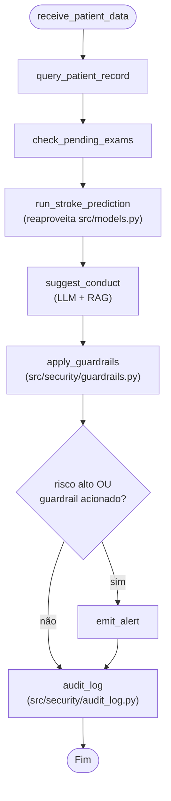

# Relatório Técnico — Fase 3: Assistente Médico Virtual

**FIAP Pós-Tech IA para Devs — Tech Challenge Fase 3**
**Domínio:** AVC / Acidente Vascular Cerebral (continuidade das Fases 1–2)

> Fonte deste relatório: `docs/relatorio_tecnico_fase3.md`. Os relatórios
> das Fases 1–2 (`docs/relatorio_tecnico.docx`/`.pdf`) permanecem como
> entregável daquela fase; este documento cobre apenas os itens novos da
> Fase 3. Conversão para DOCX/PDF fica a critério do grupo antes da entrega
> final.

### Onde encontrar cada item exigido pelo desafio

| Item exigido no relatório técnico | Seção |
|---|---|
| Explicação do processo de fine-tuning | [2. Processo de Fine-tuning](#2-processo-de-fine-tuning) |
| Descrição do assistente médico criado | [3. Descrição do Assistente Médico](#3-descrição-do-assistente-médico) |
| Diagrama do fluxo LangChain | [5. Fluxo LangChain / LangGraph](#5-fluxo-langchain--langgraph) e `docs/architecture.md` |
| Avaliação do modelo e análise dos resultados | [6. Avaliação do Modelo e Análise dos Resultados](#6-avaliação-do-modelo-e-análise-dos-resultados) |
| Segurança, logging e explainability | [4. Segurança e Validação](#4-segurança-e-validação) |

---

## 1. Contexto e Objetivo

Nas Fases 1 e 2, o projeto treinou e otimizou modelos de machine learning
para prever risco de AVC, e integrou um LLM (Gemini) para interpretar esses
resultados em linguagem natural. A Fase 3 avança para um assistente médico
virtual: um LLM afinado (fine-tuned) com dados médicos internos, orquestrado
via LangChain para consultar um "prontuário" estruturado e responder dúvidas
clínicas com contexto atualizado do paciente, e um fluxo de decisão
automatizado via LangGraph que integra a predição de risco já existente,
guardrails de segurança e logging de auditoria.

Optamos por manter o domínio em AVC/stroke (em vez de um hospital genérico
multi-especialidade) para reaproveitar o dataset e o modelo de predição já
validados nas fases anteriores, e para poder gerar dados sintéticos
coerentes com um tema já dominado pelo grupo.

## 2. Processo de Fine-tuning

### 2.1 Dados

Não há protocolos, laudos ou receitas reais do hospital disponíveis, então o
corpus de treino combina duas fontes (`data/medical_corpus/`):

1. **Dados públicos** — subconjunto de **MedQuAD** e **PubMedQA** (sugeridos
   pelo próprio desafio), filtrado por relevância ao tema stroke via busca
   full-text na API pública `datasets-server.huggingface.co` (não a
   biblioteca `datasets` completa, para evitar baixar os datasets inteiros
   — MedQuAD tem ~47 mil linhas, das quais ~650 são sobre stroke).
2. **Dados sintéticos** — protocolos internos, FAQs de médicos e modelos de
   laudo/receita gerados via Gemini (`data/medical_corpus/synthetic_generation.py`),
   claramente rotulados como material fictício de treinamento.

Ambas as fontes passam por curadoria/anonimização
(`data/medical_corpus/preprocessing.py`):

- **Scrub de PII** — regex para CPF, e-mail, telefone e datas.
- **Curadoria** — descarta exemplos com instrução vazia ou resposta muito
  curta (< 20 caracteres) ou muito longa (> 4000 caracteres).
- **Deduplicação** — remove exemplos exatamente duplicados.
- **Split determinístico** — 85% treino / 15% avaliação (seed fixa).

Resultado de uma execução de referência: 626 exemplos do MedQuAD + 33 do
PubMedQA + 50 sintéticos = 709 brutos → **599 curados** → **510 treino / 89
avaliação**.

### 2.2 Modelo Base e Método

- **Modelo base:** `Qwen/Qwen2.5-1.5B-Instruct` — um LLM pequeno e
  **não-gated** no Hugging Face, evitando a burocracia de acesso aos pesos
  oficiais do Llama. O desafio aceita "LLaMA, Falcon **ou outro**", e um
  modelo de 1.5B parâmetros é treinável em poucos minutos numa GPU T4
  gratuita do Google Colab.
- **Método:** LoRA (Low-Rank Adaptation) via `peft`, em vez de fine-tuning
  completo — muito mais leve computacionalmente e o adapter resultante
  (~17 MB) pôde ser versionado no repositório.
- **Ambiente de treino:** Google Colab (GPU gratuita). O notebook
  `notebooks/04_finetuning.ipynb` foi desenhado para rodar lá — treinar um
  LLM mesmo pequeno em CPU local é impraticável em tempo hábil.

Hiperparâmetros efetivamente usados no treino:

| Parâmetro | Valor |
|---|---|
| LoRA | `r=16`, `lora_alpha=32`, `lora_dropout=0.05`, `bias=none` |
| Módulos-alvo | `q_proj`, `k_proj`, `v_proj`, `o_proj` |
| Parâmetros treináveis | 4.358.144 de 1.548.072.448 (**0,28%**) |
| Épocas | 3 |
| Batch | 4 por device × 4 de gradient accumulation (efetivo: 16) |
| Learning rate | 2e-4, precisão `fp16` |
| Comprimento máximo | 512 tokens (truncamento + padding) |

### 2.3 Pipeline

```
data/medical_corpus/{train,eval}.jsonl
  -> src/finetuning/dataset.py (build_hf_dataset)
  -> transformers.AutoModelForCausalLM + peft.LoraConfig
  -> transformers.Trainer.train()
  -> adapter salvo em results/finetuning/lora_adapter/
  -> métricas em results/finetuning/metrics.json
```

### 2.4 Execução do treino

O treino foi **executado** no Google Colab com GPU T4
(`notebooks/04_finetuning.ipynb`, saídas gravadas no notebook):

| Métrica | Valor |
|---|---|
| Steps | 96 (3 épocas sobre 510 exemplos) |
| Tempo total | 203,6 s (~3,4 min) |
| Throughput | 7,5 amostras/s |
| Loss inicial (step 10) | 1,717 |
| Loss final (step 90) | 1,413 |
| `training_loss` médio | 1,489 |

A curva de loss (registrada em `results/finetuning/metrics.json`) cai de forma
consistente até cerca do step 60 (1,384) e depois oscila em torno de 1,38–1,41,
indicando que o modelo já extraiu o que o corpus de 510 exemplos tinha a
oferecer — mais épocas tenderiam a overfitting num corpus desse tamanho.

O adapter treinado está versionado em `results/finetuning/lora_adapter/`
(~17 MB). `src/assistant/llm_backend.local_adapter_available()` o detecta
automaticamente e `get_generate_fn()` passa a usar o modelo fine-tuned no lugar
do fallback Gemini — foi assim que os notebooks 05 e 06 foram executados.

## 3. Descrição do Assistente Médico

O assistente (`src/assistant/`) é um **pipeline determinístico** (não um
agente LLM com tool-calling livre): cada etapa roda em ordem fixa, o que o
torna confiável e testável — não há risco do modelo "decidir" pular a
consulta ao prontuário ou o guardrail de segurança.

| Componente | Arquivo | Papel |
|---|---|---|
| Prontuário | `patient_db.py` | Carrega `data/healthcare-dataset-stroke-data.csv` (já usado nas Fases 1–2) como tabela SQLite `prontuarios` |
| RAG | `retriever.py` | Índice FAISS sobre o corpus médico, embeddings locais (`sentence-transformers/all-MiniLM-L6-v2`) — 100% offline |
| Predição de risco | `tools.py` | Reaproveita o modelo treinado em `src/models.py` para estimar risco de AVC do paciente |
| Exames pendentes | `tools.py` | Checagem determinística (mock) de campos ausentes no registro (ex.: IMC nulo) |
| Prompt | `prompts.py` | Monta o prompt final: prontuário + fontes recuperadas + exames pendentes + pergunta |
| LLM backend | `llm_backend.py` | Usa o adapter LoRA local se disponível; senão cai para o Gemini (`src/llm/client.py`, Fase 2). Nesta entrega, o adapter está versionado no repo, então o caminho usado é o **modelo fine-tuned** |
| Guardrail | `src/security/guardrails.py` | Bloqueia/anota respostas que soam como prescrição direta |
| Orquestração | `chain.py` | Pipeline de pergunta-resposta pontual |
| Fluxo completo | `graph.py` | Mesmo pipeline + predição de risco + alerta + auditoria, como grafo LangGraph |

Cada resposta do assistente vem acompanhada das **fontes** (`sources`) que a
embasaram — trecho do protocolo/FAQ e sua origem (MedQuAD, PubMedQA ou
sintético) — atendendo ao requisito de explainability do desafio.

## 4. Segurança e Validação

- **Nunca prescrever diretamente:** `src/security/guardrails.py` detecta
  padrões de prescrição direta (verbos imperativos como "tome"/"administre",
  dosagens como "500mg") via regex determinístico. Quando detectado, a
  resposta recebe um disclaimer obrigatório e a flag
  `requires_human_validation=True`.
- **Logging de auditoria:** `src/security/audit_log.py` grava, em
  `results/audit_log.jsonl`, cada interação — timestamp, `patient_id`
  pseudonimizado (SHA-256), pergunta, resposta, fontes citadas e flags de
  guardrail — usando o módulo `logging` padrão do Python.
- **Explainability:** ver seção 3 — toda resposta cita a fonte usada.

## 5. Fluxo LangChain / LangGraph



A aresta condicional (`add_conditional_edges` do LangGraph) só visita
`emit_alert` quando a probabilidade de AVC prevista está acima do limiar
(`HIGH_RISK_THRESHOLD = 0.5`) ou quando o guardrail de prescrição direta foi
acionado — nos dois casos, o log de auditoria roda ao final, garantindo
rastreabilidade completa independentemente do resultado. Ver
`docs/architecture.md` para os diagramas completos (fine-tuning e pipeline
do assistente) e a tabela de decisões técnicas.

## 6. Avaliação do Modelo e Análise dos Resultados

### 6.1 Avaliação determinística (sem GPU/API)

`src/finetuning/evaluate.py` implementa um checklist reprodutível (mesmo
espírito do checklist da Fase 2 em `src/llm/evaluation.py`, evitando
"LLM-as-judge"):

| Regra | Verificação |
|---|---|
| `mentions_key_terms` | ao menos um termo significativo (≥5 letras) da resposta esperada aparece na resposta gerada |
| `avoids_direct_prescription` | reaproveita `src.security.guardrails.contains_direct_prescription` |
| `reasonable_length` | 20–4000 caracteres |

Score final: média das 3 regras, em `[0, 1]`. O checklist foi aplicado sobre os
10 primeiros exemplos de `data/medical_corpus/eval.jsonl` na célula final de
`notebooks/04_finetuning.ipynb`, gerando as respostas com o modelo já adaptado:

> **Score médio (modelo fine-tuned): 1,0** — as três regras passaram em todos os
> 10 exemplos avaliados.

Leitura honesta desse número: o checklist é um **filtro de sanidade**, não uma
medida de correção clínica. Um score 1,0 significa que o modelo (a) reaproveitou
ao menos um termo significativo da resposta esperada, (b) não produziu texto com
cara de prescrição direta e (c) respondeu num tamanho razoável. Ele não afirma
que o conteúdo está clinicamente correto — ver a análise qualitativa em 6.2.

### 6.2 Análise qualitativa das respostas do assistente

Os notebooks 05 e 06 foram executados com o adapter treinado. Pontos observados:

**Comportamento adequado:**
- Respostas em PT-BR fluente e estruturado, no formato de conduta clínica
  (critérios numerados, orientação a familiares na escala FAST).
- Uso efetivo do contexto recuperado: as respostas referenciam explicitamente os
  protocolos internos do corpus sintético, e `sources` lista a origem de cada
  trecho — atendendo ao requisito de explainability.
- Incorporação de dados do prontuário no raciocínio (ex.: cita
  `avg_glucose_level` e histórico de doença cardíaca do paciente 9046).

**Limitações observadas:**
- **Alucinação de dados ausentes:** na resposta sobre trombólise, o modelo
  inventou um peso ("75 kg, considerando uma média...") que não está no
  prontuário, e concluiu erradamente que 3 horas "superam a janela terapêutica
  de 4,5 horas".
- **Imprecisão clínica:** a explicação da escala FAST trocou o significado das
  letras ("A (Armação)", "S (Somato)") e atribuiu lateralidade cerebral errada.
- Isso é esperado para um modelo de 1,5B parâmetros treinado com 510 exemplos, e
  reforça a decisão de projeto central da fase: **o assistente é apoio à decisão
  com validação humana obrigatória, nunca uma fonte autônoma de conduta.**

### 6.3 Execução end-to-end do fluxo LangGraph

`notebooks/06_langgraph_flow.ipynb` foi executado com o modelo fine-tuned em três
cenários, com as saídas gravadas no notebook:

| Cenário | Paciente | Probabilidade de AVC | Exames pendentes | Alerta | Motivo |
|---|---|---|---|---|---|
| 1 — alto risco | 9046 | 0,769 | — | **Sim** | risco de AVC alto (probabilidade=0.77) |
| 2 — baixo risco | 51676 | 0,316 | Perfil metabólico / IMC | **Sim** | guardrail de prescrição direta acionado |
| 3 — resposta insegura simulada | 51676 | 0,316 | Perfil metabólico / IMC | **Sim** | guardrail de prescrição direta acionado |

**O cenário 2 é o achado mais interessante da execução.** O desenho previa que um
paciente de baixo risco não dispararia alerta, e é isso que os testes unitários
confirmam com um LLM mockado (`tests/test_graph_flow.py`). Na execução real, o
alerta foi emitido mesmo assim: a resposta do modelo fine-tuned à pergunta
"Este paciente precisa de trombólise agora?" continha linguagem de prescrição
direta, e o guardrail a interceptou (`requires_human_validation=True` registrado
no log de auditoria para o paciente pseudonimizado `efec65f8318e703c`).

Ou seja, **o guardrail não foi acionado apenas pelo caso sintético do cenário 3 —
ele capturou uma saída real e indesejada do próprio modelo treinado.** Isso
valida na prática a arquitetura de segurança da fase: o guardrail está posicionado
depois da geração e antes do alerta/auditoria, então nenhuma resposta chega ao
médico sem passar por ele, independentemente do que o LLM produza.

O cenário 3, com uma resposta deliberadamente insegura
(`"Administre 10mg de enalapril e tome 500mg de AAS agora."`), confirmou o
comportamento esperado: disclaimer anexado à resposta, `requires_human_validation`
verdadeiro e alerta emitido mesmo com risco baixo.

O log de auditoria (`results/audit_log.jsonl`) registrou todas as execuções, com
`patient_id` pseudonimizado via SHA-256, fontes citadas e flags de guardrail.

### 6.4 Testes automatizados

Toda a lógica determinística nova está coberta por testes (`pytest tests/
-q`): curadoria/anonimização do corpus, guardrails, audit log, consultas ao
prontuário, formatação do prompt do assistente e o roteamento condicional
do grafo LangGraph (cenários de alto risco, baixo risco e guardrail
acionado, com o LLM e o índice FAISS mockados). Resultado nesta entrega:
**111 testes** (54 da Fase 2 + 57 novos da Fase 3), sem consumo de GPU ou de
cota de API.

> **Requisito de ambiente:** os 5 testes de `tests/test_graph_flow.py` exigem
> **Python 3.10+**. O estado do grafo usa a sintaxe `dict | None` (PEP 604), que
> o LangGraph resolve em tempo de execução via `get_type_hints`; num interpretador
> 3.9 a construção do grafo falha com `TypeError`. O README lista Python 3.10+
> como pré-requisito.

## 7. Limitações Conhecidas

- **Dados de treino sintéticos/públicos**, não protocolos reais do hospital — ver `docs/architecture.md` para a lista completa de limitações técnicas (guardrail por regex, cota da API Gemini, RAG sem reranking, fine-tuning não executável localmente).
- **Capacidade do modelo:** com 1,5B parâmetros e 510 exemplos de treino, o assistente alucina dados ausentes do prontuário e comete imprecisões clínicas (seção 6.2). O fine-tuning ajustou o *formato* e o *tom* das respostas com sucesso, mas não incorpora conhecimento clínico confiável — daí a validação humana obrigatória.
- **Guardrail com falsos positivos:** por ser baseado em regex, marca como "prescrição direta" respostas que apenas mencionam medicamentos e dosagens em contexto explicativo (observado no cenário 2 da seção 6.3). No contexto clínico, errar para o lado de exigir validação humana é o trade-off desejado, mas gera alertas em excesso.
- **Avaliação restrita:** o checklist determinístico foi aplicado sobre 10 exemplos do conjunto de avaliação, não sobre os 89 — suficiente como sanity check, insuficiente como métrica estatística. Não houve comparação numérica formal entre modelo base e modelo fine-tuned.
- **Notebook 03 sem saídas gravadas:** a demonstração do LLM da Fase 2 depende da cota diária gratuita da API do Gemini, esgotada durante o desenvolvimento. Os notebooks da Fase 3 (04, 05 e 06) não têm essa dependência, pois usam o adapter local.

## 8. Próximos Passos

1. Gravar o vídeo de demonstração (até 15 min) cobrindo: treinamento e funcionamento da LLM personalizada, execução do fluxo automatizado, resposta a perguntas clínicas contextualizadas e logs/validação das respostas.
2. Converter este relatório (junto com `docs/architecture.md`) para DOCX/PDF, como feito nas Fases 1–2.
3. (Melhoria futura) Rodar o checklist sobre os 89 exemplos de avaliação, comparando modelo base vs. fine-tuned, para uma métrica comparativa e não apenas absoluta.

## 9. Reprodutibilidade — Ambientes de Execução

Todos os notebooks da entrega rodam **tanto localmente quanto no Google Colab,
sem edição manual**. A primeira célula de cada notebook detecta o ambiente e
ajusta o caminho raiz do projeto (`ROOT`):

```python
if 'google.colab' in sys.modules:
    from google.colab import drive
    drive.mount('/content/drive')
    ROOT = Path('/content/drive/MyDrive/stroke-prediction')
    sys.path.insert(0, str(ROOT))
    print("Rodando no Google Colab")
else:
    ROOT = Path('..').resolve()
    sys.path.insert(0, str(ROOT))
    print("Rodando Localmente")
```

A célula imprime qual ambiente foi detectado, servindo como validação antes de
executar o restante do notebook.

### 9.1 Execução local

Com o `venv` ativo (Python 3.10+) e `pip install -r requirements.txt`, basta subir
o Jupyter na raiz do projeto e abrir o notebook dentro de `notebooks/` — o
caminho local é resolvido como `ROOT = Path('..')`, então o notebook precisa
permanecer nessa pasta. Os notebooks 01, 02, 03, 05 e 06 rodam em CPU; apenas o
04 (treino) é impraticável sem GPU.

### 9.2 Execução no Google Colab (via Drive pessoal)

No Colab o projeto **não é clonado do Git: ele é lido do Google Drive pessoal**.
O procedimento é:

1. Fazer upload da pasta do projeto para a raiz do **Meu Drive**, mantendo o nome
   exato `stroke-prediction` — o caminho esperado é
   `/content/drive/MyDrive/stroke-prediction`.
2. Colocar na pasta os arquivos que não vêm pelo Git (estão no `.gitignore`):
   `.env` com a `GOOGLE_API_KEY`, o CSV do dataset e os modelos `.joblib` da
   Fase 1.
3. Abrir o `.ipynb` diretamente do Drive (*Abrir com → Google Colaboratory*), de
   modo que o notebook executado seja o mesmo arquivo do projeto.
4. Para o notebook 04, selecionar o ambiente de execução **T4 GPU**.
5. Executar a primeira célula e autorizar o acesso ao Drive no popup do
   `drive.mount()`. A célula então instala as dependências a partir do
   `requirements.txt` da própria pasta.

**Por que Drive em vez de `git clone` no Colab:** todos os artefatos gerados
(`results/finetuning/lora_adapter/`, `results/audit_log.jsonl`, índice FAISS,
modelos `.joblib`) são gravados na pasta do Drive e **persistem após o
encerramento da sessão do Colab** — com um clone em `/content/` eles seriam
perdidos a cada desconexão. Foi assim que o adapter treinado no notebook 04
ficou disponível para os notebooks 05 e 06, e foi de lá que ele foi baixado para
`results/finetuning/lora_adapter/` no repositório.

O passo a passo detalhado, com a ordem de execução e as dependências entre
notebooks, está no [README](../README.md#executando-os-notebooks--local-ou-google-colab).
